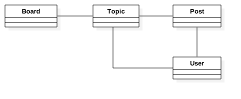
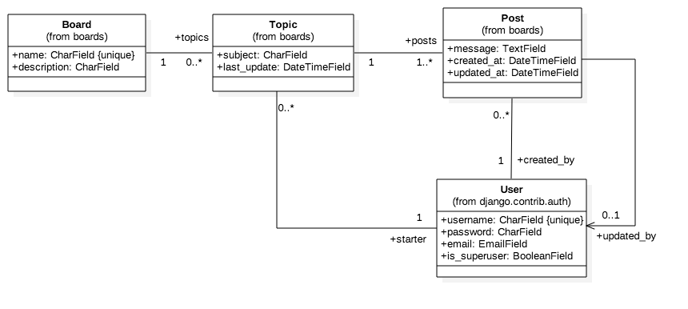

# [Django](https://simpleisbetterthancomplex.com/series/beginners-guide/1.11/)

### python安装

`brew install python3`

### virtualenv

* virtualenv 安装

`brew install virtualenv`

* virtualenv 环境建立

```
virtualenv venv -p 	python3 --no-site-packages
		环境名		python版本		不安装任何的包
```

* virtualenv 切换环境

```
source venv/bin/activate
```

* virtualenv 退出环境

```
deactivate
```

## Django

* Django安装

```
pip install django
```

* Django安装工程

```
django-admin startproject myproject
```

* Django运行工程

```
python manage.py runserver
```

* Django 哲学


## 建立网络论坛

* 创建第一个app
```
django-admin startapp boards
```


---

## 分析阶段


#### 用例中提取对象


#### 使用用例图 


## 设计阶段

#### 为对象设计UML图



#### 类设计
* 对象间从属引用关系

> 用类图表示出来(比如一个User能够关联至少一个Topic，每个Topic只能关联一个User)
>
> 类图里面强调是类本身的属性，而不是类之间的关系(关系可有由被动来表示，例如create_by)
 
* 对象自身的属性
* 对象的能力(方法)

> 静态对象被操作的方法



### Model设计

* 按照类设计的设计数据库
* django使用类来转换成数据库对象，通过对Model类的实例化操作，将转变成对数据库的操作
* 转换过程如下图


* django默认实现了User类


* 执行`python manage.py makemigrations`将在boards/migrations下面产生0001_initial.py文件，
它代表了当前应用的model的状态，也就说跟踪数据sachema的变化，Django会使用这个文件来创建表和列

```
Migrations for 'boards':
  boards/migrations/0001_initial.py
    - Create model Board
    - Create model Post
    - Create model Topic
    - Add field topic to post
    - Add field updated_by to post
```
#### 命令行操作数据库
```
python manage.py shell

from boards.models import Board
#创建一条新的记录
board = Board(name='Django', description='This is a board about Django.')
#保存记录，这个将保存到数据库中
board.save()

#取出所有的记录对象
Board.objects.all()
```

### 视图设计

#### 使用model数据
* 导入数据库操作类


### 使用模板引擎

#### 引入templates增强view
#### why?
重复利用templates

* 新建templates目录


* 创建template文件


* 添加templates目录查找路径


### 静态文件路径设置

#### why？
使用django设置静态文件的统一路径，不需要使用相对路径和绝对路径了

* 设置静态文件查找路径


* template中使用static路径


### Django中创建管理员用户

* 创建命令

`python manage.py createsuperuser`

交互式确认

```
Username (leave blank to use 'vitorfs'): admin
Email address: admin@example.com
Password:
Password (again):
Superuser created successfully.
```

### Django URLs添加新的url

* 在urls.py 中添加新的url


* 在view中添加新的处理函数


* templates添加新的模板


### Django创建可复用template

*  在templates目录中新建一个基准模板


* 引用基准模板并实现模板中的块


### 表单处理

#### 注意事项

* 验证提交表单的用户
* 传给服务器的都是字符串
* 验证表单数据合法性
* 注意SQL注入攻击
* 注意XSS攻击
* 注意CSRF攻击

#### 添加表单url


#### 添加表单提交网页


> <em>表单页面显示地址和表单提交页面地址是相同的</em>

#### 表单显示逻辑和表单处理逻辑


#### Topics展示页面


#### Topics页面上添加new topic按钮


#### 使用Django Form API

* Django Form有两种表单，一种是forms.Form,这种表单是一般通用处理。另一种是forms.ModelForm
这种表单处理和应用中model相关的数据

**为什么有两种Form呢？**

假如你已经有了一个注释model，你想要创建一个让人提交注释的表单，在这种情况下，
在你的表单中定义新的field类型是冗余的，因为你已经在model中定义了这个field。

**Form对象调用save()方法作用**

每个ModelForm都有save()方法，这个方法创建和保存数据库相关的model对象

#### ModelForm和Model使用示例
```
from django.db import models
from django.forms import ModelForm

TITLE_CHOICES = (
    ('MR', 'Mr.'),
    ('MRS', 'Mrs.'),
    ('MS', 'Ms.'),
)

class Author(models.Model):
    name = models.CharField(max_length=100)
    title = models.CharField(max_length=3, choices=TITLE_CHOICES)
    birth_date = models.DateField(blank=True, null=True)

    def __str__(self):
        return self.namen

class Book(models.Model):
    name = models.CharField(max_length=100)
    authors = models.ManyToManyField(Author)

class AuthorForm(ModelForm):
    class Meta:
        model = Author
        fields = ['name', 'title', 'birth_date']

class BookForm(ModelForm):
    class Meta:
        model = Book
        fields = ['name', 'authors']
```

* 定义一个新的表单类


* 在view中重构表单处理函数


* 使用Form对象来更新template中的form字段


* 调整表单属性


#### 让你的表单更漂亮
1. `pip install django-widget-tweaks`

2. 添加应用


3. 更改template


4. 让tweak库自动检查form表单有效性


#### 重用表单模板

1. 提取重用模板


2. 引入重用模板


### 认证

#### 使用Django内建的账号app

1. `django-admin startapp accounts`

2. 在setting.py中添加app

