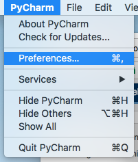
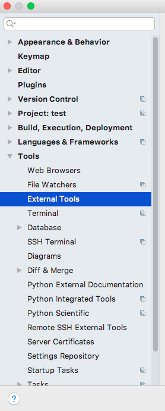
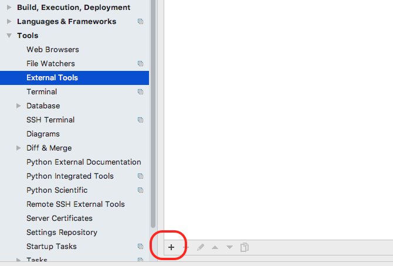
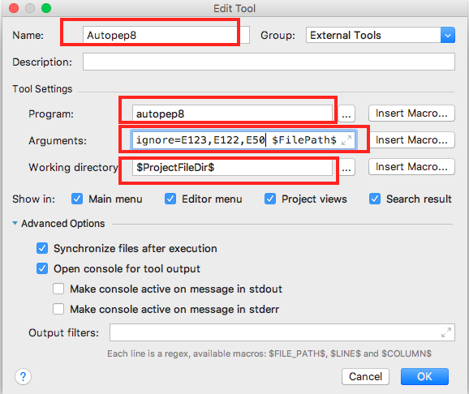
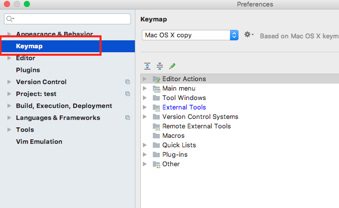
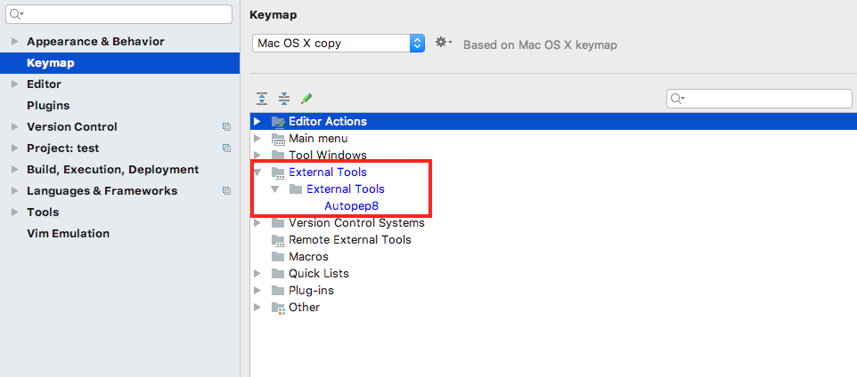
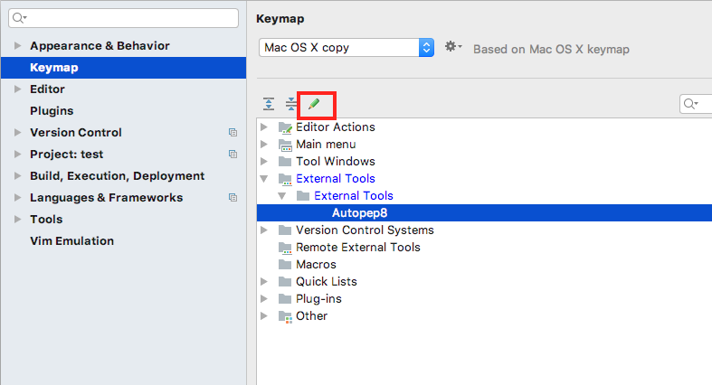
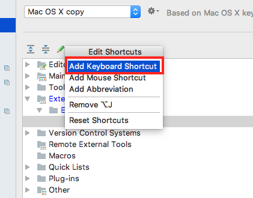

# Pycharm 设置 autopep8

###  版本信息

* Pycharm verion 2017.3.3 Professional Edition

### 配置autopep8
* 使用命令`pip install autopep8`来安装autopep8在你的机器上

* 打开Tool->External Tool选项

* 点击图中`+`新建一个外部工具链接

* 按下图所示，填写之前安装的autopep8的路径信息,在点击`OK`

### 配置autopep8快捷键

* 打开Keymap选项

* 顺序展开External Tools->External Tools->Autopep8, 并选中

* 点开快捷键编辑按钮

* 点击`Add Keyboard Shortcut`选项

* 敲下你选择的快捷键，并点`OK`返回

